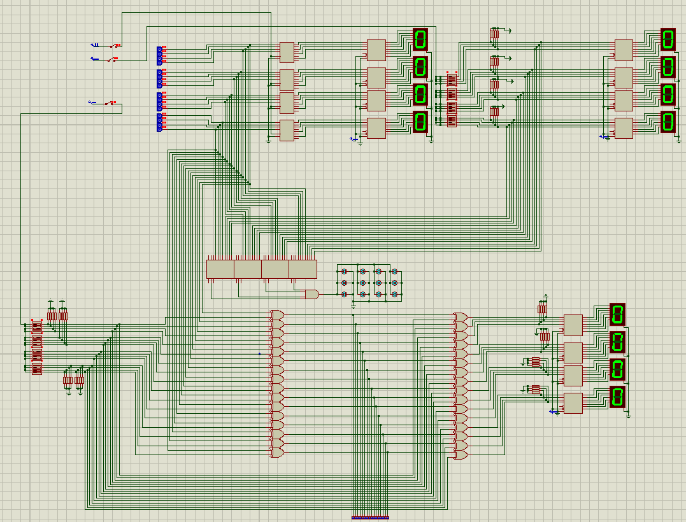
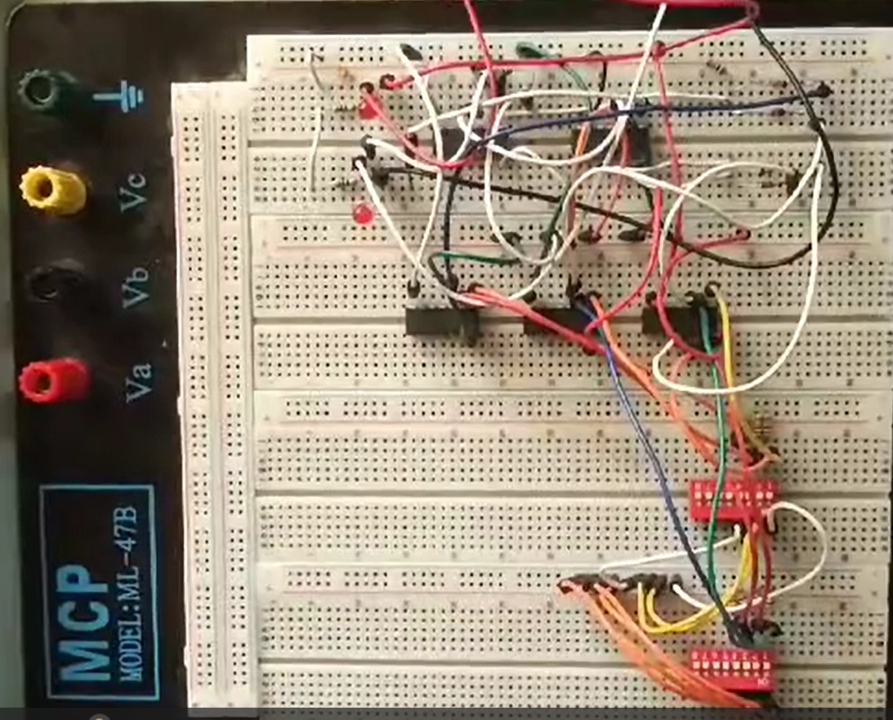

# FourDigitPasswordSecuritySystem

Four Digit Password Security System using Digital logic ICs.

## Badges

# About the project

This project implements a 4 digit password system using Digital logic gate ICs like NAND, NOR, and AND gates. The complete implementation checks 4 digits and also has a encryption/decryption mechanism but the hardware implementaion only checks 4 bits due to lack of time and funds. The circuit is not complex, and can be very easily implemented.

## Acknowledgements

 - [Digital Logic Design by Morris M. Mano]
 

## Authors

- [@usmanawan50](https://github.com/usmanawan50/usmanawan50.git)

## Deployment 

The deployment is very simple. Look up the ICs required from the report and make circuit according to the hardware schematic.

## Circuit schematics

### Proteus schematic

### Hardware schematic

## Usage/Examples

### Proteus demo

See Demo from Sources folder.

### Hardware demo

See Demo from Sources folder.
